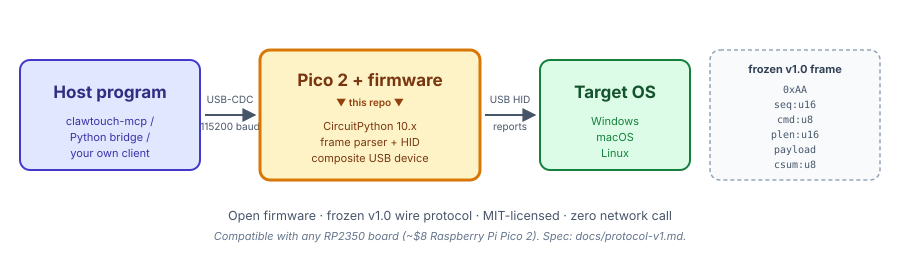

[English](README.md) | **简体中文**

# clawtouch-hid

> **ClawTouch 的开源硬件层。**
> Raspberry Pi Pico 2 上的 CircuitPython 固件、它说的冻结版 USB-CDC 通信协议,
> 以及给宿主端直接驱动这块板子用的 Python 协议模块。

[](LICENSE)
[](docs/protocol-v1.zh-CN.md)
[](https://circuitpython.org/)

<p align="center">
  
</p>

---

## 这是什么?

本仓库包含三样东西,加在一起就能把一块 Raspberry Pi Pico 2 变成"ClawTouch
HID 设备"—— 一台 USB 接入的键鼠,可以让另一台 PC 上跑的程序通过串口
指令通道驱动它:

1. **`firmware/`** —— 跑在 Pico 2 上的 CircuitPython 固件。它把自己作为
   USB 复合设备(HID 键盘 + HID 鼠标 + USB-CDC 串口对)挂载给宿主操作系统。
   固件**自己不做任何决策** —— 它等 CDC data 端口收到带帧的命令,然后把
   每条命令翻译成一个 HID 报告。
2. **`clawtouch_hid_protocol/`** —— 一个小巧、零依赖的 Python 模块,
   定义了冻结版 v1.0 通信协议(命令码、payload 格式、构帧 helper)。
   如果你想跳过 MCP 直接驱动板子,从这个模块开始。
3. **`docs/`** —— [冻结版 v1.0 协议规范](docs/protocol-v1.zh-CN.md) 和
   [烧录指南](docs/flash-guide.zh-CN.md)。

这块板子也是 [clawtouch-mcp](https://github.com/tinqiao-oss/clawtouch-mcp)
MCP server 跟它对话的硬件。如果你只想"让 Claude Desktop 控制真实键鼠",
从那个仓库开始就行 —— 不必读本仓库。**本仓库是给固件玩家、协议审计者、
和想在同一块硬件上自己造宿主栈的人**。

> 📦 MIT 协议。没有后端,没有 LLM,没有上层 agent 逻辑 —— 只有协议
> 本身和跟它对话的固件。

## 为啥要用物理 HID 设备?

大部分"AI 控制电脑"的 demo 都要求在目标机上跑 agent 进程,并走 OS 层
合成输入 API。这类路径在 kiosk 锁机环境、嵌入式测试台架、跨设备 RPA
等"目标机 HID 输入侧必须保持干净"的场景里有局限。USB HID 物理外设走
标准 OS HID 驱动栈,跟任何插上的键盘鼠标走同一条数据通路 —— 目标机
不需要安装任何鼠标键盘驱动或 HID agent 进程, Pico 是 standard USB HID
class, OS 原生识别。本仓库里的固件就是把一块 ¥55 的 Pico 2 变成这种
外设需要的最少代码。

> ⚠️ 本仓库只覆盖**输入侧**: 协议帧 → HID 报告。视觉反馈 (agent 看屏)
> 不在本仓库范围 —— 本机模式下抓 agent 所在机的屏即可, 跨机模式下需要
> 自行配 HDMI 采集卡 / VNC / API 验证 / 盲控. 完整部署模式区分见
> [`clawtouch-mcp`](https://github.com/tinqiao-oss/clawtouch-mcp) README
> 「部署模式」一节。

## 适用范围 —— 一台设备只对应一个目标

硬件是 USB 外设,只有单一宿主连接。本仓库里的固件也是 —— 一块 Pico
对应一台目标机。这是设计本身决定的:**单设备单宿主的对位控制硬件**,
要控 10 台机器就烧 10 块 Pico。

**适合**: RPA / 装不了软件的设备自动化测试 / 无障碍辅助 (AI agent +
HID = 残障用户的真实键盘) / 跨机工作流 (目标机必须保持干净不装 agent)。

**不适合**: 批量账号注册 / 消费平台多账号运营 (单设备单宿主结构上
就不合, 用户需自行检查适用法律和平台规则) / 针对特定应用的脚本化
适配层 (选择器、固定流程脚本 —— 这些该在上层 agent / RPA 框架做,
本仓库只做底层 HID 原语)。

## 可接受用途

本固件把宿主发来的协议帧翻译成 HID 报告。本项目**不支持、不文
档化、不协助**以下用例:

- 规避、绕过或干扰任何目标平台的反作弊、反滥用、限速、风控等
  技术管理措施。
- 操作用户自身不合法拥有或未获显式授权操作的账户。
- 目标应用服务条款 (ToS) 在用户所在司法辖区禁止的活动。
- 违反适用法律的活动 —— 包括但不限于《反不正当竞争法》§13
  (互联网专条, 2025-06-27 修订通过, 2025-10-15 起施行) 所指
  "以欺诈、胁迫、避开或者破坏技术管理措施等不正当手段获取、
  使用其他经营者合法持有的数据" 等情形; 《个人信息保护法》;
  《网络安全法》; 及其他司法辖区的等效法律。

以上仅为本项目维护者的支持与文档范围声明, **并非**在 MIT 协议之
外对源代码的使用、修改或再分发施加额外限制 —— 源代码本身的使用、
修改和再分发仍完全受 MIT 协议规约。用户应**独立判断**自己具体用
例是否符合适用法律和目标平台的 ToS。

本仓库**不含**任何 AI / ML 模型, 也不生成文本、图片、音频、视频
内容。内容生成相关的合规义务 (例如《人工智能生成合成内容标识
办法》2025-09-01 施行) 由驱动本固件的上层 agent 承担, 不由本
固件承担。

## 硬件

| 项 | 规格 |
|------|------|
| 主控 | RP2350 (Raspberry Pi Pico 2 参考板) |
| 固件框架 | CircuitPython 10.x |
| 协议版本 | v1.0 (2026-03-15 冻结) |
| USB 接口 | HID (键盘 + 鼠标) + CDC (console + data) |
| CDC 波特率 | 115200 (data 通道) |

你可以用任意 RP2350 板 (例如 Raspberry Pi Pico 2, ¥55 左右从电子件
零售商可买), 烧上本仓库的固件, 就是一台能用的 ClawTouch HID 设备。
成品商业版 (带外壳) 是独立产品; 本仓库聚焦硬件层的开源方案。

## 快速上手

1. **给 Pico 2 烧 CircuitPython** —— 见 [docs/flash-guide.zh-CN.md](docs/flash-guide.zh-CN.md)
   的三步流程(按 `BOOTSEL` → 拖入 UF2 → 拖入固件)。
2. **从 Python 跟它对话** —— 装宿主端协议模块,发一条 `PING`:

   ```bash
   pip install clawtouch-hid-protocol pyserial
   ```

   ```python
   import serial
   from clawtouch_hid_protocol import build_ping, HidCommand

   ser = serial.Serial("COM7", 115200, timeout=2)   # 用你的 CDC data 端口
   ser.write(build_ping(seq_id=1).serialize())
   resp = HidCommand.deserialize(ser.read(7))
   print(resp.cmd_type)                              # CommandType.PONG
   ```

3. **或者跳过线协议,直接用 [clawtouch-mcp](https://github.com/tinqiao-oss/clawtouch-mcp)**
   —— 同样的固件、同样的硬件,但暴露为 Model Context Protocol server,
   可直接插入 Claude Desktop / Cline / Continue / OpenClaw / Hermes 等。

完整可运行的 PING 示例见 [`examples/ping_test.py`](examples/ping_test.py)。

## 通信协议速览

```
+------+--------+--------+---------+---------+----------+
| 0xAA | seq:u16| cmd:u8 | plen:u16| payload | csum:u8  |
+------+--------+--------+---------+---------+----------+
   1B     2B       1B       2B       plen       1B
```

* 多字节整数用小端
* `csum` = 前面所有字节累加和 & 0xFF
* payload 最大 1024 字节

定义了 12 个命令码:`PING/PONG`、`MOUSE_MOVE/CLICK/SCROLL`、
`KEY_PRESS/RELEASE/TYPE_STRING/COMBO`、`STATUS_REQUEST/RESPONSE`,
外加 `ACK` 和 `ERROR`。完整字节级布局见
[docs/protocol-v1.zh-CN.md](docs/protocol-v1.zh-CN.md)。

## 实际效果

一段真实的 Python REPL 会话, 只用 `clawtouch-hid-protocol` (本仓库
的宿主端模块) + `pyserial`, 通过 USB-CDC 跟真实 Pico 2 对话。每个
字节都是冻结版 v1.0 帧; 任何刷了本仓库固件的 Pico 2 都能这么跑:

```text
$ python
>>> import serial
>>> from clawtouch_hid_protocol import (
...     build_ping, build_mouse_click, build_key_type_string, HidCommand
... )
>>> ser = serial.Serial("COM7", 115200, timeout=2)   # CDC data 端口

# ── PING / PONG 握手 (冻结版 v1.0 帧) ──────────────────────────────
>>> ser.write(build_ping(seq_id=1).serialize())
# 线上字节 (hex):    aa 01 00 01 00 00 ac
#                    │  └─────┘  │  └───┘ └─ csum (前面字节和的低字节)
#                    │   seq u16 │   plen u16 (payload 空)
#                    └ 前导符    └ cmd: PING (0x01)
>>> HidCommand.deserialize(ser.read(7)).cmd_type
<CommandType.PONG: 0x02>             # Pico 已响应 ✓

# ── 在 (640, 360) 左键点击 —— 宿主上真实鼠标在动 ─────────────────
>>> ser.write(build_mouse_click(
...     seq_id=2, button=1, x=640, y=360
... ).serialize())
>>> HidCommand.deserialize(ser.read(7)).cmd_type
<CommandType.ACK: 0x40>              # Pico 已确认 ✓

# ── 输入字符串 —— 宿主当前焦点应用真实出字 ────────────────────────
>>> ser.write(build_key_type_string(seq_id=3, text="Hello").serialize())
>>> HidCommand.deserialize(ser.read(7)).cmd_type
<CommandType.ACK: 0x40>              # Pico 已把 'Hello' 作为 HID 报告打出 ✓
```

完整的帧格式和 15 个命令码见
[docs/protocol-v1.zh-CN.md](docs/protocol-v1.zh-CN.md); 可运行的
冒烟示例在 [`examples/ping_test.py`](examples/ping_test.py)。

## 仓库布局

```
clawtouch-hid/
├── clawtouch_hid_protocol/   ← Python 协议模块(宿主端,pip 可装)
├── firmware/                 ← Pico 2 的 CircuitPython 固件
│   ├── boot.py               ← USB 描述符设置(上电只跑一次)
│   ├── code.py               ← HID 执行器主循环
│   ├── packet_parser.py      ← 帧提取器,无硬件依赖,可在 PC 上测
│   └── lib/adafruit_hid/     ← 捆绑的 HID 库 (MIT,见 NOTICE)
├── docs/                     ← 协议 spec + 烧录指南(中英双语)
├── examples/                 ← 可运行的冒烟测试
├── pyproject.toml            ← 构建 clawtouch-hid-protocol 上 PyPI
├── LICENSE                   ← MIT
├── NOTICE                    ← 第三方组件出处
└── README.md / README.zh-CN.md
```

## 设计哲学

* **固件不含业务逻辑。** 只做"把带帧字节翻译成 HID 报告"。一切决策 ——
  打什么字、什么时候点击、多步操作怎么编排 —— 都在宿主侧。这让固件
  小、可审、可被不同宿主栈复用。
* **协议是冻结的。** v1.0 在 2026-03-15 发布后不再改。未来新能力以新
  命令码的形式加进同一个信封,既有的 v1.0 命令永远兼容。
* **以值为准,不以名为准。** 固件、`clawtouch_hid_protocol` 模块、协议
  spec 三处各列了一份命令码。数值是真理,Python 名称只是为了可读。

## 协议小怪点(知道了就行)

`KEY_PRESS` 和 `KEY_COMBO` 的 payload 字节序不一样:

* `KEY_PRESS` (0x20):`[keycode, modifiers]`
* `KEY_COMBO` (0x23):`[modifiers, keycode]`

这是文档化的行为,不是 bug —— `KEY_COMBO` 历史上是从单独的"发快捷键"
意图长出来的,保留了自己的布局。三处实现(固件、协议模块、spec)
一致。如果你写第四份实现,注意顺序。

## 开源路线图

ClawTouch 采用 **open-core** 模式:硬件与协议层开源,集成的商业产品闭源。

| 组件                                              | 状态                  |
|---------------------------------------------------|-----------------------|
| **clawtouch-hid** (本仓库:固件 + 协议)           | ✅ 已发布             |
| **[clawtouch-mcp](https://github.com/tinqiao-oss/clawtouch-mcp)** (MCP server) | ✅ 已发布 |
| **[clawtouch-skills](https://github.com/tinqiao-oss/clawtouch-skills)** (给 LLM agent 用的 markdown skill 文件) | ✅ 已发布 |
| **clawtouch-bridge-sdk** (Python + Node SDK)      | 🔵 规划中             |
| 后端服务 / 桌面端 / 应用适配器 / 视觉模型         | 🔒 闭源 — 邮件咨询 `support@tinqiao.com` |

## 相关工作

ClawTouch 不是第一个在 AI agent 和目标机之间塞 HID 硬件的项目。最相近的几个:

* **[PiKVM Pico HID](https://docs.pikvm.org/pico_hid/)** —— Pi-Pico-as-HID-relay
  的开创者, 服务于远程运维 KVM 场景。**仅支持 RP2040** (写本节时 Pico 2 /
  RP2350 未列入), 提供 KVM Web UI 不是 agent 接口, 线协议无版本管理 —
  宿主直写 raw HID descriptor。
* **[`sjmf/kvm-serial`](https://github.com/sjmf/kvm-serial)** + 其 MCP 封装
  **[`sunasaji/mcp-serial-hid-kvm`](https://github.com/sunasaji/mcp-serial-hid-kvm)** ——
  用 CH9329 / CH9350L 现成 USB-HID ASIC + 视频采集卡, 上层带可选 MCP server。
  **架构上最直接的同类项目**。用固化功能芯片 (固件不可自定义); ClawTouch
  改用 Pico 2 + CircuitPython, 走冻结 v1.0 线协议, 新增 opcode 对老宿主
  向前兼容, 固件本身可审计可改。
* **[HIDAgent](https://arxiv.org/abs/2602.00492)** —— CMU 的 Bigham 等人,
  2026-01 发布。< $30 的 Raspberry Pi Pico + CircuitPython 研究 toolkit,
  专门让 UI agent 通过物理 HID 驱动目标机。**硬件预算和设计意图上最相近的
  学术同行**; 配套是 Python 库, 不带版本化线协议 / MCP server / skill 仓库。

如果你的目标机就是 agent 本机, 用
[`AB498/computer-control-mcp`](https://github.com/AB498/computer-control-mcp)、
[`domdomegg/computer-use-mcp`](https://github.com/domdomegg/computer-use-mcp) 或
各种 `mcp-pyautogui` 实现会更轻 —— 它们在进程内调 PyAutoGUI。ClawTouch
针对的是**跨设备**场景: agent 和目标机不是同一台。

## 常见问题

**必须买 ClawTouch 硬件才能用吗?**
不用。一块裸 Raspberry Pi Pico 2(¥55 左右)刷上本仓库的固件就是一台
能用的 ClawTouch HID 设备。商业产品在此基础上做了外壳、QA、配送和
售后支持 —— 线协议完全一致。

**需要 ClawTouch 后端 / 账号 / API key 吗?**
不需要。本仓库里没有任何东西访问网络。固件通过 USB 跟宿主对话,宿主
通过 USB 跟固件对话 —— 全部栈就这两层。

**没有物理 Pico 也能跑哪些?**
`clawtouch_hid_protocol` 模块和 `firmware/packet_parser.py` 都是无
硬件依赖的纯 Python,任何机器都能跑。`firmware/code.py` 只能跑在
CircuitPython 上,因为它在 import 时就依赖板上的 `usb_hid` / `usb_cdc`
模块,普通 Python 解释器跑不起来 —— 离线测试请用协议模块或 packet_parser。

**跟闭源的 ClawTouch 桌面端有什么区别?**
本仓库只是最底层 —— 纯 HID 原语 + 冻结线协议 —— 让其他 agent 框架
能在不绑定 ClawTouch 完整产品的前提下使用硬件。闭源桌面端是跑在同一
套硬件之上的独立 agent, 邮件咨询 `support@tinqiao.com`。

## 参与贡献

欢迎 PR:文档修订、新示例、针对 v1.0 协议的新语言绑定、英文翻译、
硬件兼容性报告。

**不接受**的 PR:agent 循环逻辑或应用层功能(故意排除在范围外 ——
固件只把帧翻译成 HID 报告)、破坏 v1.0 兼容性的协议改动、应用专属
适配器(这部分在闭源桌面端)。

## 关于项目

`clawtouch-hid` 由 **北京亭桥科技** 维护 —— ClawTouch 产品团队
([clawtouch.cn](https://clawtouch.cn)),做即插即用的 USB 设备,让 LLM
agent 在 HID 层操控真实的 Windows / macOS / Linux 桌面。本仓库是
整个产品栈的开源硬件层。

## License

MIT © 北京亭桥科技有限公司 — 见 [LICENSE](LICENSE) (英文版, 法定
依据) 和 [LICENSE.zh-CN.md](LICENSE.zh-CN.md) (非官方中文翻译,
仅供参考)。

本仓库捆绑的第三方组件 (Adafruit CircuitPython HID 库) 和许可信息
见 [NOTICE](NOTICE). 商标 (ClawTouch、Tinqiao 等亭桥旗下商标, 及本
仓库引用的第三方商标) 由 [TRADEMARKS.md](TRADEMARKS.md) 单独规约
—— MIT 协议**不**授予任何商标权利。

商业部署 / 企业支持 / OEM 硬件合作咨询:`support@tinqiao.com`
